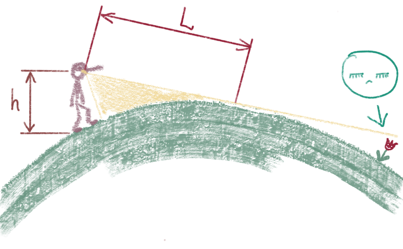
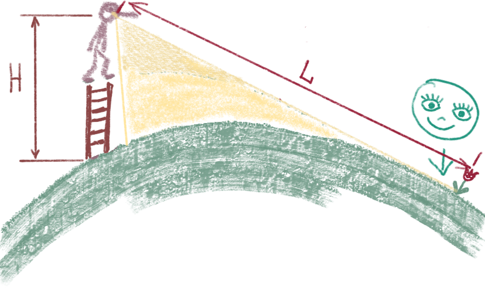
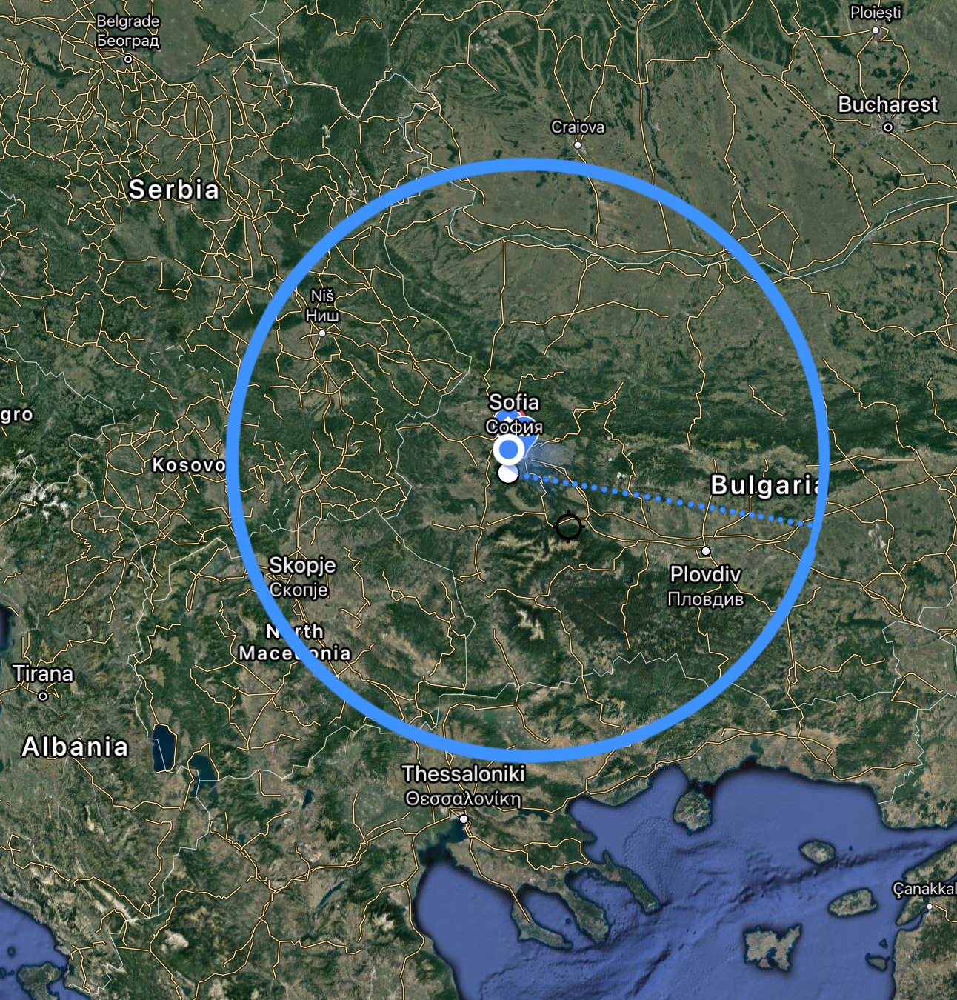

# Колко далеч е хоризонтът?

Видимото разстояние в километри до хоризонта приблизително равно на

$L = 113\sqrt{h}$ , h e височината в километри, от която гледаме

Например, ако гледаме от Черни връх, разположен на височина 2925m, то хоризонтът приблизително ще виждаме на

$113\sqrt{2,925} = 193km$

